# Takım İsmi
BioGuards   

# Takım Üyeleri
-Sultan Kocagöz  :Product Owner / Developer   
-Hatice Bekkaya  :Scrum Master / Developer   
-Emirhan Topçu   :Developer   
-Hakan Ertürk    :Developer   

# Ürün ile İlgili Bilgiler
## Ürün İsmi
BioGuard   
## Ürün Açıklaması
Geliştirilecek bu sağlık uygulaması, bireylerin kişisel sağlık verilerini dijital ortamda güvenli bir şekilde saklamalarını ve bu veriler doğrultusunda kişiselleştirilmiş sağlık hizmeti almalarını amaçlamaktadır. Kullanıcılar uygulama üzerinden; mevcut hastalıklarını, tahlil sonuçlarını, kullandıkları ilaçları, alerjilerini ve benzeri sağlık verilerini kaydedebileceklerdir.   

Yapay zeka destekli analiz motoru sayesinde kullanıcılar, güncel sağlık durumları ve semptomlarını sisteme girerek; geçmiş tıbbi verileriyle birlikte değerlendirilen, olası hastalık tahminleri ve sağlık tavsiyeleri alabileceklerdir. Bu sistem sadece semptom analiziyle sınırlı kalmayıp, kullanıcıların mevcut tedavi süreçlerini de göz önünde bulundurarak öneriler sunacaktır. Bu özellik aynı zamanda hastane yoğunluklarını da azaltmaya yardımcı olacaktır.   

Ayrıca uygulama, kullanıcıların ilaç kullanım düzenini desteklemek amacıyla günlük doz hatırlatmaları sağlayacak ve tedaviye uyumu artırmaya yönelik uyarı sistemiyle birlikte çalışacaktır. Bu yönüyle uygulama, hem sağlık takibi hem de tedavi destek hizmeti sunan entegre bir platform olacaktır.   

## Ürün Özellikleri
-Kullanıcılar hastalık geçmişi, alerjiler, kronik rahatsızlıklar gibi sağlık bilgilerini sisteme kaydedebilir.   
-Tahlil sonuçları manuel olarak girilebilir veya dosya olarak yüklenebilir (örneğin kan tahlili, MR, röntgen vb.).   
-Kullandığı ilaçları isim, doz ve kullanım sıklığı bilgisiyle birlikte kaydedebilir.   
-Yapay zeka destekli sistem, kullanıcının belirtilerini ve mevcut sağlık verilerini analiz ederek olası hastalık tahminlerinde ve tavsiyelerde bulunur.   
-Sistemin sunduğu geri bildirimler, bilgilendirici ve yönlendirici niteliktedir (örneğin bir uzmana başvurulması gerektiğine dair öneriler).   
-Kullanıcıya ilaçlarını ne zaman ve hangi dozda alacağına dair günlük hatırlatmalar gönderilir.   
-İlaç kullanım geçmişi sistemde tutulur ve gerektiğinde görüntülenebilir.   
-Hastane randevuları, tahlil günleri ve periyodik kontroller için takvim hatırlatmaları yapılabilir.   

## Hedef Kitle
-Erken tanı arayan kullanıcılar   
-Bakım alan hastalar   
-Tahlil takibi için kronik hastalar   
-İlaç saatleri takibinde zorlanan hastalar   
-Doktora gitmeye zaman bulamayan,yoğun çalışma temposunda olan kişiler   
-Sporcular ve aktif yaşam süren bireyler   
-Çocukların aşı,ilaç ve sağlık bilgilerini takip etmek isteyen ebeveynler   
 
## Product Backlog Url
[Trello Backlog Board](https://trello.com/b/ZUlsNPKs/bioguard)

# Sprint 1
Sprint Notları: Bu spring’te temeller atılmaya başlanmıştır.Uygulama için yapılan temel tasarımlar tasarım için açılan kartın açıklamasında ek olarak vardır.  

Tahmin Edilen Tamamlanacak Puan: 100 Puan  

Tahmin mantığı: Bu sprint boyunca tamamlanan görevler düşünülerek tahmini puanın 100 olmasına karar verilmiştir.Backend görevleri 25 er puandan, gerekli verilerin araştırılması 30 puandan ve frontend için tasarım oluşturulması 30 puandan değerlendirilmiştir.  

Daily Scrum:  
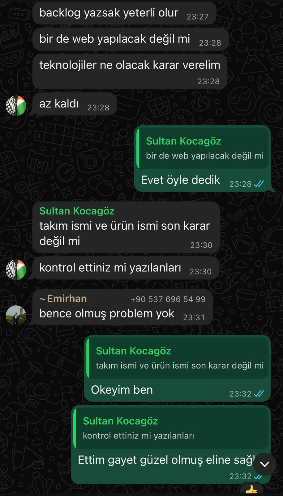
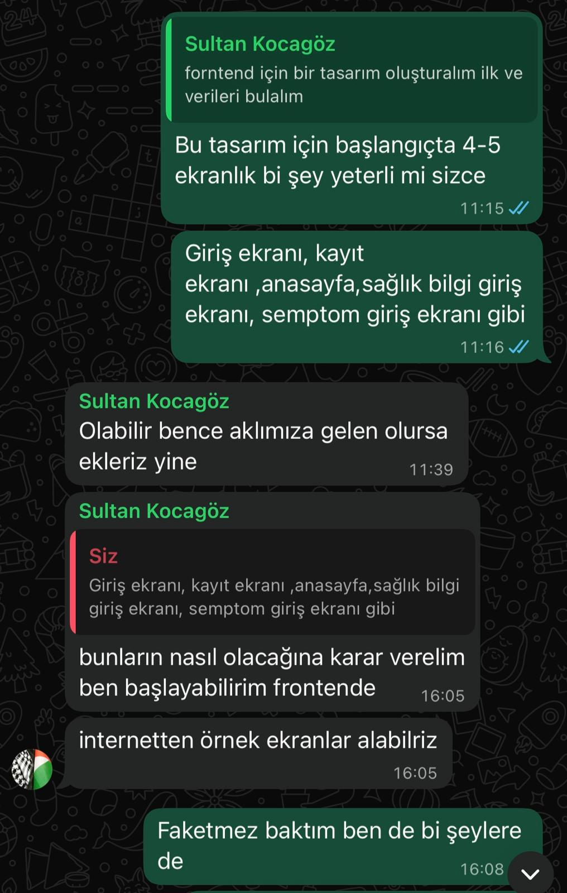
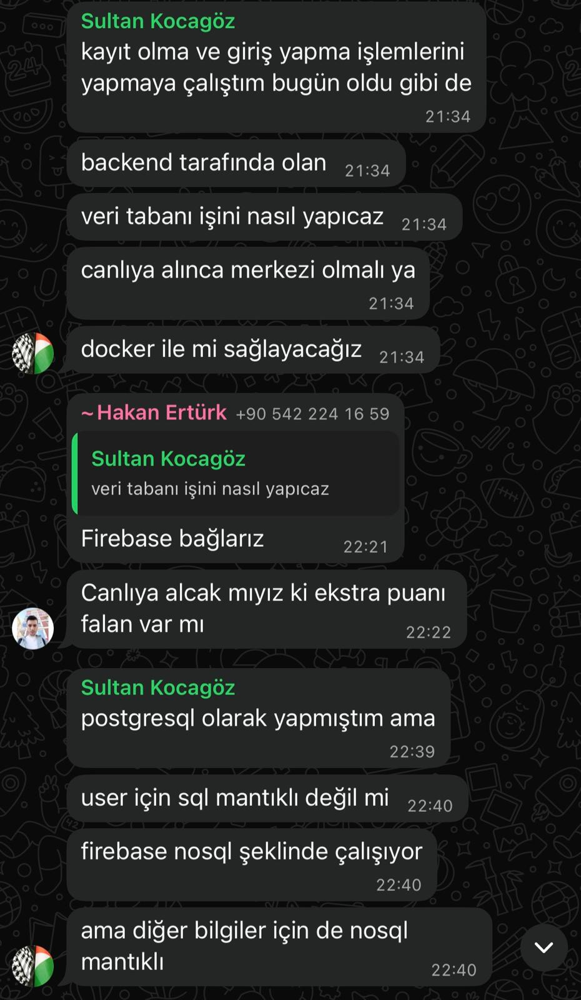
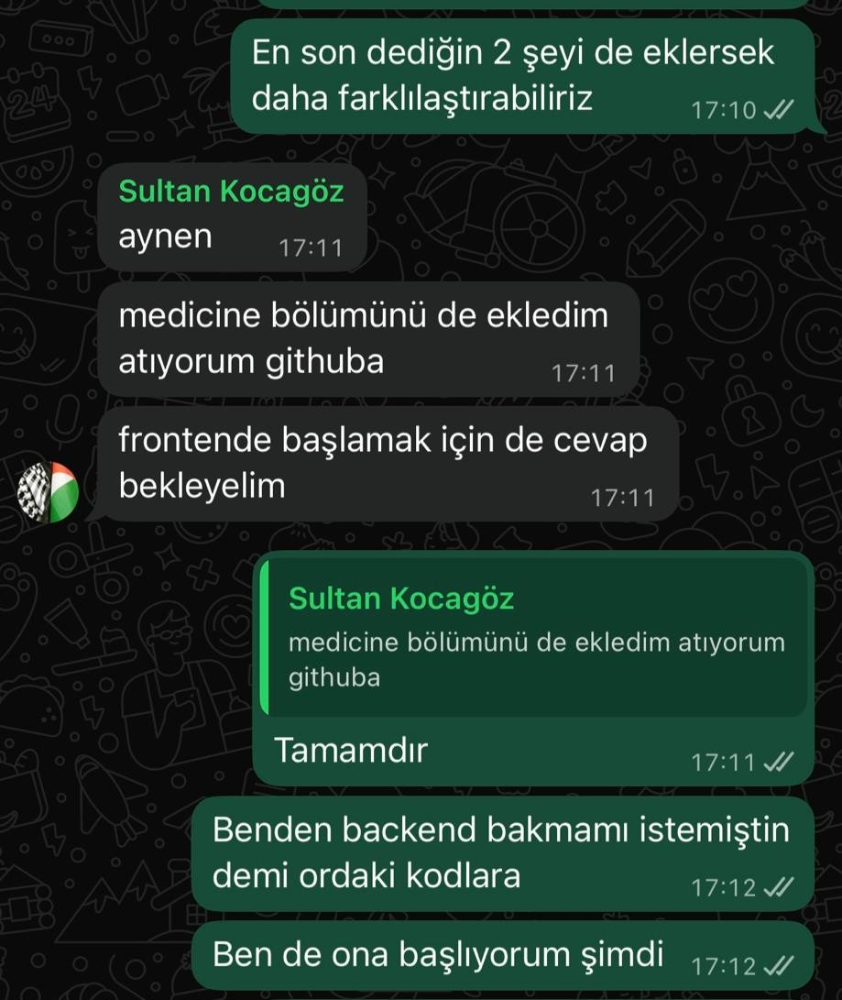   

Sprint Board Update:Kartlar için gerekli açıklamalar ve dosyalar kart açıklamasında bulunmaktadır.   
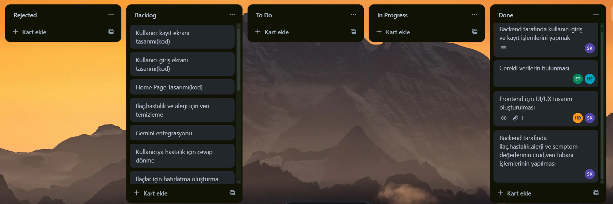  

Ürün Durumu Screenshots:Ürünün frontendi daha hazırlanmamıştır.Şu anlık sadece backend tarafında geliştirme yapılmıştır.Ürünün frontend tasarım çalışmaları devam etmektedir.  
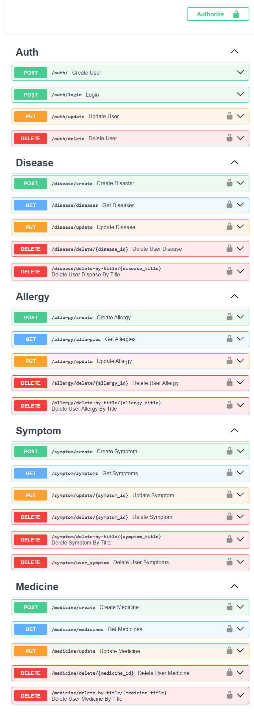   
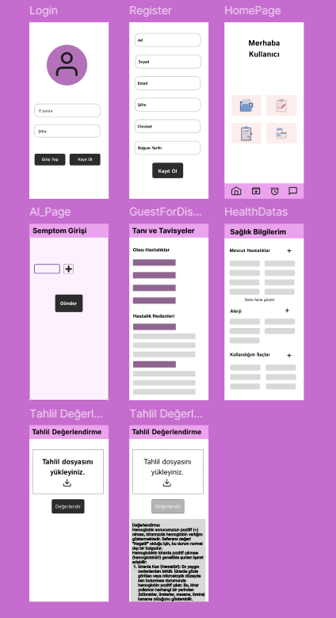  

Sprint Review:  
Bu Sprint’te genellikle başlangıç için yapılması gereken görevler yerine getirildi.Backend tarafında kullanıcı giriş ve kayıt işlemleri,veri tabanı kaydı gibi şeyler varken frontend için figma aracılığıyla UI/UX tasarım yapılmaya çalışıldı.Figma’dan yapılan tasarım taslakları product backlog içinde kartların açıklama kısmında bulunmaktadır. Veri alanında ise veri bulunmaya çalışıldı.Tamamlanması beklenen işlerin çoğu yapılmıştır.  
Sprint review katılımcıları:Sultan Kocagöz,Hatice Bekkaya  

Sprint Retrospective:  
Bir sonraki Sprint’te daha aktif olma kararı alınmıştır.Projenin ilerleyişi için daha fazla araştırma ile daha iyi temeller atmaya karar verilmiştir.   

# Sprint 2
Sprint Notları: Bu sprintte ilerleyen proje süreci adına bazı değişimler yapılmıştır.Frontend tasarımında sizlerinde bilgisi dahilinde flutter kullanılmaya başlanıp önceki tasarımlar değiştirilmiştir.

Tahmin Edilen Tamamlanacak Puan: 80 Puan  

Tahmin mantığı: Bu sprint boyunca tamamlanan görevlere göre tahmini puanın 80 olmasına karar verilmiştir.Frontend tasarım kodları ayrı görevler olarak oluşturulup herbiri 20 puan üzerinden değerlendirilmiştir.

Daily Scrum: 
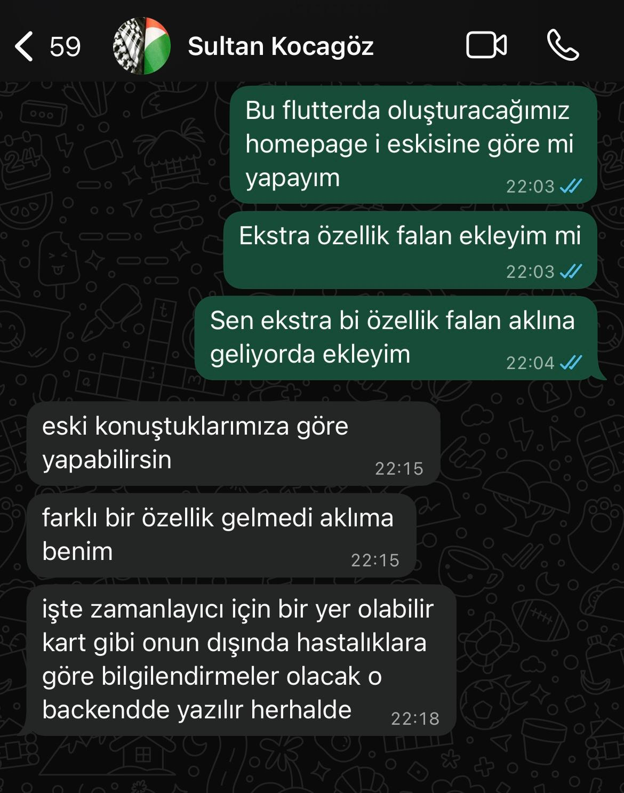
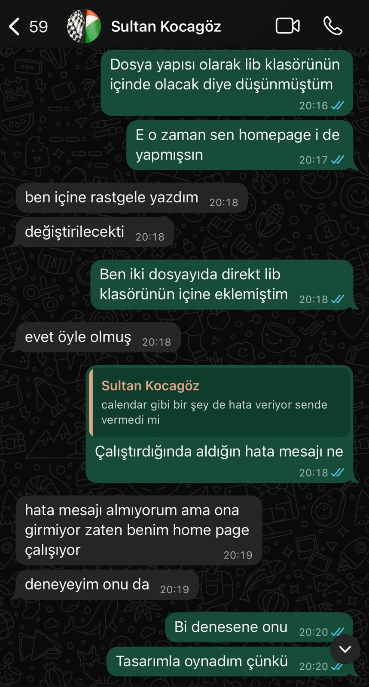
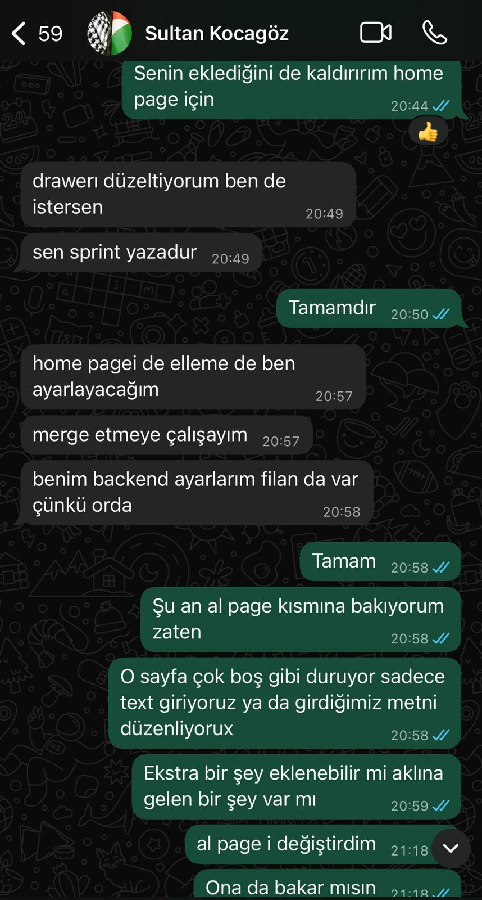
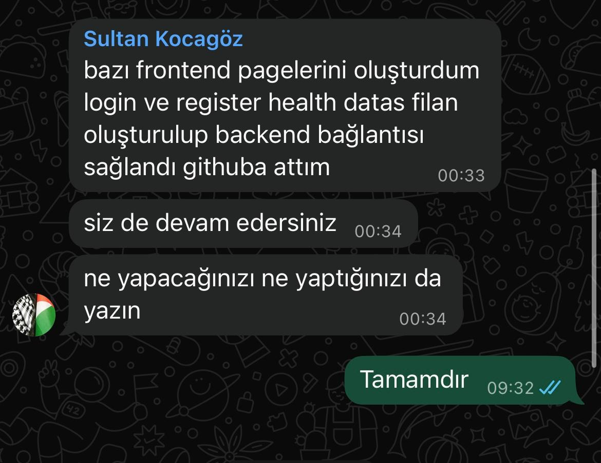   

Sprint Board Update:Kartlar için gerekli açıklamalar ve dosyalar kart açıklamasında bulunmaktadır.
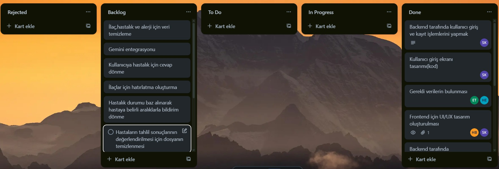 
Ürün Durumu Screenshots:

Sprint Review:  
Bu Sprint’te ileriye dönük araştırmalar yapılıp genel olarak frontend çalışmaları yapılmıştır.Figmadan yapılan tasarım çalışmalarımız iptal edilip yeni bir yol çizilmiştir.Bu sürece flutterla devam edileceği kararlaştırılıp ilgili sayfalar flutter aracılığı ile oluşturulmaya başlanmıştır. 

Sprint review katılımcıları:Hatice Bekkaya,Sultan Kocagöz

Sprint Retrospective:  
Bir sonraki Sprint’te daha aktif olma kararı alınmıştır.Projenin ilerleyişi için daha fazla araştırma ile daha iyi temeller atmaya karar verilmiştir.

